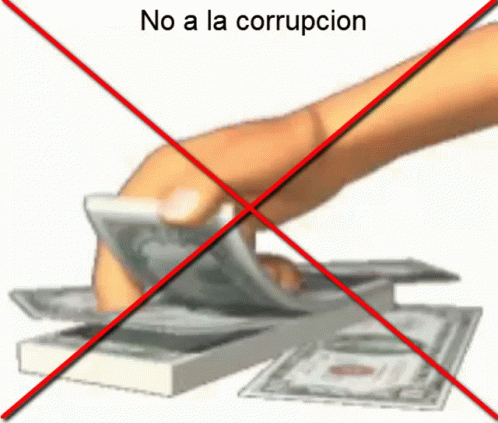

```{r setup, include=FALSE}
library(tint)
# invalidate cache when the package version changes
knitr::opts_chunk$set(tidy = FALSE, cache.extra = packageVersion('tint'))
options(htmltools.dir.version = FALSE)
setwd("E:/GitHub/corrupcion_peru")
```

```{r fig-nocap-margin-first, fig.margin=TRUE, fig.width=1, fig.height=1, cache=TRUE, echo=FALSE}

```
# Costo de la Corrupción

 
La  Estamos rumbo al bicentenario y el Perú sigue padeciendo no solo la segunda ola del virus de la Covid-19 con todas sus variantes, sino también el fenómeno de la [Corrupción] (https://idehpucp.pucp.edu.pe/notas-informativas/la-percepcion-de-la-corrupcion-en-el-peru-en-los-ultimos-anos/). El cual se encuentra arraigado desde la existencia misma de la humanidad. 

Actualmente, la lucha contra la corrupción se ha convertido en uno de los desafíos de mayor relevancia en el mundo entero; así como, en nuestro país.

Sabemos que el efecto de la corrupción impide el desarrollo político, social y económico de los estados, ya que, transgrede la democracia y enfatiza las desigualdades, siendo más evidente en el contexto de la pandemia.El presente asrticulo dará una revisión historica de los hechos de corrupción mas grandes y cuanto ha afectado a nuestro país.


```{r configuracion_inicial,echo=FALSE,comment=F,warning=FALSE,message=FALSE}
library(sp)
library(rgdal)
library(RColorBrewer)
library(classInt)
library(sf)
library(ggplot2)
library(rvest)
library(RSelenium)
library(robotstxt)
library(readxl)
library(dplyr)
library(tidyr)
library(readxl)
library(plotly)
library(openxlsx)
library(xlsx)

cor<-read.xlsx("E:/GitHub/corrupcion_peru/corrupcion.xlsx")
cor<-cor[-c(11:13),]
cor<-cor[,-c(8)]
cor<-cor[,-c(1:2)]
names(cor) <- c("Manejo_irregular","corrup_pred&mil","Soborno","perd_indirecta","inv_directa")


cor$Manejo_irregular= as.numeric(cor$Manejo_irregular)
cor$`corrup_pred&mil`= as.numeric(cor$`corrup_pred&mil`)
cor$Soborno= as.numeric(cor$Soborno)
cor$perd_indirecta= as.numeric(cor$perd_indirecta)
cor$inv_directa= as.numeric(cor$inv_directa)


st <- as.Date("1990-1-1")
en <- as.Date("1900-1-1")
fech_o <- seq(en, st, by = "+10 year")


st1 <- as.Date("1999-12-31")
en1 <- as.Date("1909-12-31")
fech_f <- seq(en1, st1, by = "+10 year")

cor = data.frame(fech_o, fech_f, cor)
```
### Pregunta 1
El maximo puntaje de un equipo dentro de un departamento

```{r grafico_general, echo=FALSE,fig.height=30,comment=F,warning=FALSE,message=FALSE}
dinamico<-cor %>%
  ggplot(aes(x= fech_o,
             y= Manejo_irregular, 
             color = Manejo_irregular)) +
  geom_line(size=2) +
  geom_point(size=1) +
  labs(title = 'Manejo_Irregular en {frame_along}',
       x = 'fecha_o',
       y = 'Manejo_irregular') +
  theme_minimal() +
  transition_reveal(fech_o)
dinamico
```
