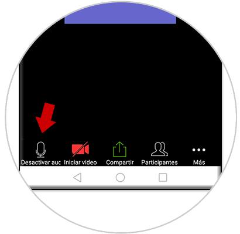
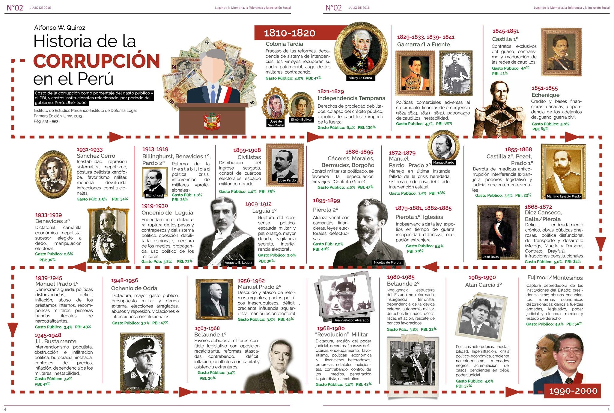

class: inverse middle center

```{r images, include=FALSE}
include_image <- function(path,                           
                          html_opts = "width=45%", 
                          latex_opts = html_opts,
                          alt_text = ""){
  if(knitr:::is_html_output()){
    glue::glue("{{ {html_opts} }}")
  } else if(knitr:::is_latex_output()){
    glue::glue("{{ {latex_opts} }}")    
  }
}
image_link <- function(path,
                       link,
                       html_opts = "height: 200px;",
                       latex_opts = "width=0.2\\textwidth",
                       alt_text = "",
                       centering = TRUE){
  if(knitr:::is_html_output()){
    if(centering){
    glue::glue('
      <center><a target="_blank" class="page-link" href="{link}"></a></center>')
    } else {
      glue::glue('
      <a target="_blank" class="page-link" href="{link}"></a>')
    }
  }
  else if(knitr:::is_latex_output()){
    if(centering){
      glue::glue('\\begin{{center}}
        \\href{{{link}}}{{\\includegraphics[{latex_opts}]{{{path}}}}}
        \\end{{center}}')
    } else
      glue::glue('\\href{{{link}}}{{\\includegraphics[{latex_opts}]{{{path}}}}}')
  }
  
}
```

```{r initial, echo = FALSE, cache = FALSE, results = 'hide',warning=FALSE}
library(knitr)
options(htmltools.dir.version = FALSE, tibble.width = 55, tibble.print_min = 4)
opts_chunk$set(
  echo = FALSE, warning = FALSE, message = FALSE, comment = "#>",
  fig.path = 'figure/', cache.path = 'cache/', fig.align = 'center', 
  fig.width = 12, fig.show = 'hold', fig.height = 8.5, # 16:9
  cache = TRUE, external = TRUE, dev = 'svglite'
)
read_chunk('R/theme.R')
read_chunk('R/main.R')
```

```{r theme-remark}
```


```{r xaringan-editable, echo=FALSE}
xaringanExtra::use_editable(expires = 1)
```

```{r style-share-again, echo=FALSE}
xaringanExtra::style_share_again(
  share_buttons = c("facebook","twitter", "linkedin", "pocket","instagram")
)
```

```{r broadcast, echo=FALSE}
xaringanExtra::use_broadcast()
```

```{r xaringan-scribble, echo=FALSE}
xaringanExtra::use_scribble()
```

```{r xaringan-logo, echo=FALSE}
xaringanExtra::use_logo(
  image_url = "https://manosaladata.netlify.app/img/owl1.png"
   # image_url = "https://manosaladata.netlify.app/img/best_azul.jpg"
  
  )
```


```{r xaringanExtra-clipboard, echo=FALSE}
xaringanExtra::use_clipboard()
```

```{r xaringanExtra-search, echo=FALSE}
xaringanExtra::use_search(show_icon = TRUE)
```

## Por favor silenciar los micrófonos

.animated.bounce[

]

---
class: inverse middle center

## ¿Cómo hacerlo?

.animated.bounce[

]


---
class: inverse middle center

## Motivación

.animated.bounce[

]

---

## Corrupción en el Perú  

* La corrupción es "el abuso de poder público para obtener beneficio
particular"
* Hay dos categorías muy diferentes de corrupción administrativa: la primera acontece cuando por los actos corruptos se cometen "de acuerdo con las reglas" y la segunda cuando las operaciones se desarrollan
* La corrupción es, hasta la actualidad, uno de los problemas más preocupantes para la población peruana y afecta directamente la legitimidad de las instituciones públicas
* De acuerdo al Barómetro de las Américas de Latin American Public Opinion Project, Perú fue el país más preocupado por el tema de la corrupción a nivel regional, un 36% de la población lo señala como el principal problema, por encima de otros temas como la economía, la seguridad, la inestabilidad política y otros. Ese mismo resultado se registró, según el Instituto Nacional de Estadística e Informática (2020)


---

## Sobre la data

.center[

]


---

## ¡Manos a la data!


.center[


]


